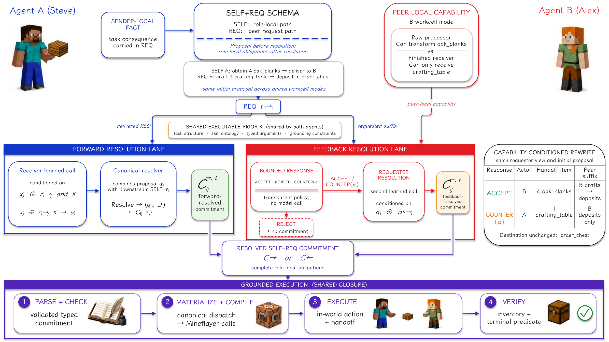

<div align="center">

# GenCoord

### Skill-Path Commitments under Private Information

**Executable coordination for embodied teams with distributed private information.**

<p>
  <a href="docs/GenCoord_preprint.pdf"><b>Paper</b></a>
  &nbsp;·&nbsp;
  <a href="paper/"><b>LaTeX Source</b></a>
  &nbsp;·&nbsp;
  <a href="paper/anc/source_data/"><b>Evidence</b></a>
  &nbsp;·&nbsp;
  <a href="docs/REPRODUCIBILITY.md"><b>Reproducibility</b></a>
  &nbsp;·&nbsp;
  <a href="#citation"><b>Citation</b></a>
</p>

<p>
  <a href="docs/GenCoord_preprint.pdf"></a>
  <a href="paper/"></a>
  <a href="paper/anc/source_data/"></a>
  
  
</p>

**Peng He**<sup>1,&#42;</sup>, **Junning Zhu**<sup>2,&#42;</sup>, **Haohan Yuan**<sup>3</sup>, **Jianpeng Liang**<sup>4</sup>  
<sup>&#42; Equal contribution</sup>

<table width="100%">
  <tr>
    <td width="25%" align="center" valign="middle">
      <a href="https://www.tsinghua.edu.cn/">
        
      </a>
    </td>
    <td width="25%" align="center" valign="middle">
      <a href="https://www.bnbu.edu.cn/">
        
      </a>
    </td>
    <td width="25%" align="center" valign="middle">
      <a href="https://www.charlotte.edu/">
        
      </a>
    </td>
    <td width="25%" align="center" valign="middle">
      <a href="https://ucsd.edu/">
        
      </a>
    </td>
  </tr>
  <tr>
    <td align="center"><sub><sup>1</sup> <b>Tsinghua University</b><br>Beijing, China</sub></td>
    <td align="center"><sub><sup>2</sup> <b>Beijing Normal-Hong Kong Baptist University</b><br>Zhuhai, China</sub></td>
    <td align="center"><sub><sup>3</sup> <b>University of North Carolina at Charlotte</b><br>Charlotte, United States</sub></td>
    <td align="center"><sub><sup>4</sup> <b>University of California San Diego</b><br>San Diego, United States</sub></td>
  </tr>
</table>

</div>

<p align="center">
  
</p>
<p align="center">
  <sub><b>GenCoord in one view.</b> Distributed private facts become a shared executable commitment, then flow through grounded execution and terminal-state verification.</sub>
</p>

> **GenCoord turns distributed private facts into executable, multi-step commitments that preserve their task meaning across communication, resolution, grounding, execution, and verification.**

<p align="center">
  <code>private fact → β(z) → SELF + REQ → resolved commitment → grounded skills → verified joint action</code>
</p>

## Overview

Embodied teams frequently distribute the decisive facts of a joint route across agents: one agent sees the goal, another knows the relevant workcell capability, and the team must bind actor, handoff item, destination, and continuation into one coordinated plan.

GenCoord makes that execution-relevant binding explicit. A local Qwen3.5-0.8B model composes role-local paths in a typed, multi-step `SELF+REQ` schema. Bounded `ACCEPT` / `REJECT` / `COUNTER` feedback resolves peer-local capability information, and the resolved commitment is parsed, schema-checked, canonically materialized, compiled to Mineflayer skills, executed, and verified through handoff and terminal state.

| Distributed private facts | Executable commitment | Verified joint action |
| --- | --- | --- |
| Goal, capability, inventory, and route evidence stay with the agents that observe them. | One typed `SELF+REQ` object binds actor, handoff item, destination, and continuation. | The resolved object drives canonical materialization, skill compilation, grounded execution, handoff, and terminal verification. |

## Headline results

| Capability resolution | Commitment horizon | Communication efficiency |
| :---: | :---: | :---: |
| **50% → 100%** | **91.3% → 98.1%** | **92.8% less peer traffic** |
| Bounded capability feedback closes paired local ambiguity across **three independently trained seeds**. | Multi-step commitments raise held-out-template success while reducing model decisions from **2.91 → 1.98 per episode** (**−32%**). | Short DSL preserves **128/128** closed-loop semantic clusters and reduces median time-to-commitment by **68.2%** versus controlled free-form. |

Paired counterfactual interventions isolate a bidirectional content-to-route mechanism: changing the injected task consequence while holding the world, call schedule, and executor fixed redirects requester revision and receiver execution exactly along the corresponding route.

## The commitment interface

```text
SELF resource.obtain(q=4,item=oak_planks)
  > resource.deliver(q=4,item=oak_planks,to=agent_b)

REQ agent_b craft.item(q=1,input=oak_planks,item=crafting_table)
  > resource.deliver(q=1,item=crafting_table,dst=order_chest)
```

The same schema carries proposal-time routes, resolved role-local obligations, and the executable object consumed by the grounded stack. Short DSL presents this structure directly as the agent-to-agent executable interface.

## Release

The repository packages the complete paper, supplementary material, final figures, canonical evidence, and deterministic builders into one research release.

| Asset | Included material |
| --- | --- |
| **Preprint** | Combined paper and supplementary PDF. |
| **Paper source** | Main paper, supplement, references, venue-support files, and generated LaTeX tables. |
| **Figures** | Final paper figures used throughout the manuscript and supplement. |
| **Canonical evidence** | Source values, episode metrics, paired comparisons, trace registry, source ledger, and experiment summaries. |
| **Deterministic builder** | Standard-library Python pipeline for rebuilding and validating the released E1/E2 tables. |

## Quick start

```bash
git clone https://github.com/JulianZJN/GenCoord.git
cd GenCoord

# Build the paper and supplement
make main
make supplement
make combined

# Rebuild and verify the canonical evidence
make evidence
make verify-evidence
```

<details>
<summary><b>Build requirements and outputs</b></summary>

- A recent TeX Live distribution with PDFLaTeX and BibTeX.
- Python 3.9 or newer; the evidence builder uses the Python standard library.
- `pdfunite` for the combined preprint target.

```text
paper/main.pdf
paper/supplement.pdf
build/GenCoord_preprint.pdf
```

The build produces a 9-page main paper, a 16-page supplement, and a 25-page combined preprint.

</details>

The arXiv-oriented source order is recorded in [`paper/00README.json`](paper/00README.json).

## Reproducibility

The deterministic evidence pipeline validates the experimental schema, conditions, episode counts, semantic-cluster unit, training seeds, parse and grounding validity, fallback count, and selected paired-comparison deltas before emitting the released tables and canonical data.

```bash
make evidence
make verify-evidence
```

The consistency target rebuilds every generated output and verifies exact agreement with the tracked research artifacts. Full commands and generated-file maps are documented in [`docs/REPRODUCIBILITY.md`](docs/REPRODUCIBILITY.md).

## Repository structure

```text
.
├── README.md
├── CITATION.cff
├── Makefile
├── assets/
│   ├── teaser.png
│   └── affiliations/
├── docs/
│   ├── GenCoord_preprint.pdf
│   └── REPRODUCIBILITY.md
└── paper/
    ├── main.tex
    ├── supplement.tex
    ├── references.bib
    ├── figures/
    ├── tables/
    └── anc/
        ├── scripts/build_e1e2_tables.py
        └── source_data/
```

## Citation

The arXiv identifier will be added when the public record is assigned. The repository already provides citation-ready metadata in [`CITATION.cff`](CITATION.cff):

```bibtex
@misc{he2026gencoord,
  title        = {GenCoord: Skill-Path Commitments under Private Information},
  author       = {Peng He and Junning Zhu and Haohan Yuan and Jianpeng Liang},
  year         = {2026},
  note         = {Preprint}
}
```

## Acknowledgements and license

GenCoord uses Minecraft as its embodied evaluation environment and compiles validated commitments to Mineflayer skills. Original project code and build glue are MIT-licensed. Manuscript source, figures, evidence, institutional marks, venue-support files, and third-party materials follow the path-level terms recorded in [`LICENSE`](LICENSE), [`THIRD_PARTY_NOTICES.md`](THIRD_PARTY_NOTICES.md), and [`assets/affiliations/SOURCES.md`](assets/affiliations/SOURCES.md).
